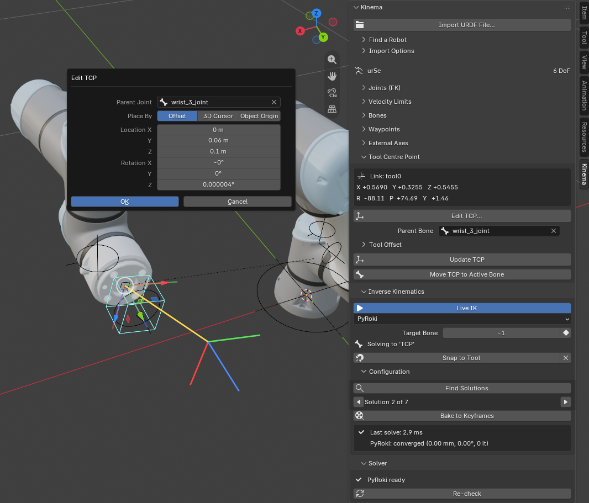

# The tool centre point

The **tool centre point** — TCP — is the spot on the robot that actually does the work.
The tip of the welding torch. The centre of the gripper's grasp. The point of the pen.

It is the single most important frame on the machine, because every task is defined in
terms of it. "Put the weld here" means "put the TCP here". Nobody specifies a robot task
in terms of where its elbow goes.

## Why it needs to exist separately

A robot's last joint is somewhere inside the wrist. The thing you care about is several
centimetres further out, at the end of whatever tool is bolted on — and that offset
changes every time the tool changes.

So the TCP is a marker: a frame that rides on the end of the chain at a defined offset,
representing the working point rather than the last mechanical joint.

In Kinema it is a bone in the `Kinema/TCP` collection, created automatically on import
unless you turn **Create TCP** off.

{ .screenshot }

## What it is used for

**It is what IK aims at by default.** When you [add an IK target](../tutorials/animate-ik.md),
the target is created at the TCP, and the solver's job is to put the TCP where the target is.
No TCP means nothing to aim, and Add IK Target refuses.

Only by default, though: the **Bones** panel can point the solver at any joint bone instead,
and that choice is keyframable. See
[aiming somewhere else](../tutorials/animate-ik.md#aiming-at-a-different-bone).

**It is what you measure from.** The Tool Centre Point panel reports its position and its
orientation live — useful when you need the tool at a specific pose rather than somewhere
that merely looks right.

**It is what you hang a tool on.** Pick the TCP's row in the **Bones** panel and attach a
torch mesh, an emitter, a light or a camera; it rides the working point exactly, with an
offset you can type. See
[attaching things to a link](links-and-joints.md#attaching-things-to-a-link).

## Orientation matters too

The TCP has a direction, not just a position. Kinema aligns it so its **+Z points along
the tool's approach direction** — the way the tool is "looking", the direction it would
travel to touch something.

This follows the convention used throughout robotics, so a TCP frame in Blender means the
same thing it means in the robot's own documentation.

It matters in practice because IK solves for orientation as well as position. Rotating the
IK target rotates the tool. If you are animating a gripper approaching an object, the
approach *direction* is usually as important as the point.

## Where zero is: the mounting flange

A tool is specified from the **mounting flange**, the face on the end of the wrist it bolts
to. That is where a tool's drawing puts its origin, so it is where Kinema measures the TCP
from.

Industrial robot descriptions define the flange as a link of its own, usually twice over by
the ROS-Industrial convention:

- `tool0`, with **Z out of the flange face**;
- `flange`, with X out of it.

Kinema uses `tool0`. Where a description has only a `flange`, it turns it so Z points out of
the face, as `tool0` would. A fresh import puts the TCP right there, with a tool offset of
zero and the approach axis pointing out of the flange. So a TCP from a tool's drawing, say
`Z = 0.15`, goes in as it is, and means 150 mm out of the face.

The angles are roll, pitch and yaw about fixed X, Y and Z, which is what URDF's
`<origin rpy="…">` means, so a tool transform copied out of a description goes in unchanged
too.

!!! info "Robots without a flange, and rigs from before 0.6.0"
    A description that defines no flange has nowhere better to measure from than the last
    joint's own **link frame**. The importer then puts the TCP on the description's deepest
    link and fills the offset with the distance to it, since fixed joints get no bone and
    nothing else on the rig would show it.

    Rigs imported before 0.6.0 also measure from the link frame, so their offsets keep the
    meaning they were typed with. Import the robot again to measure from the flange. The
    Tool Offset section says which it is, for example *From the mounting flange (tool0)*.

## Moving the TCP

The default TCP sits on the flange, which is right for a bare robot. As soon as a real tool is
attached, you want the working point of *that tool*.

### Edit TCP…

**Edit TCP…** in the [Tool Centre Point panel](../reference/sidebar.md#tool-centre-point)
opens a dialog that shows the result in the viewport before anything changes. The new TCP is
drawn as a set of axes beside the current one, and it follows the fields as you drag them.

Pick the **Parent Joint**, the one the tool is bolted to, then place the TCP by one of three
routes:

| Place by | Use it when |
|---|---|
| **Offset** | You have the numbers: a location and rotation from the flange, off the tool's drawing |
| **3D Cursor** | The working point is a spot on the tool mesh. Snap the 3D cursor to that vertex first (<kbd>Shift</kbd>+<kbd>S</kbd> → *Cursor to Selected*), then open the dialog |
| **Object Origin** | The working point is an empty you placed, or the origin of the tool mesh itself |

The cursor and the object can give the TCP's orientation as well as its location (**Use Its
Rotation**), or leave the orientation at the typed one. Either way the dialog shows the offset
it will store, measured from the flange where it stands now, so this works with the robot
posed. Clicking away to look at the viewport closes the dialog, but opening it again brings
back what you had.

### The panel's fields

The Tool Centre Point panel also takes a **Parent Bone** and a **Tool Offset** directly: pick
the joint, type the offset, press **Update TCP**. **Reset** zeroes the offset, putting the TCP
back on the flange.

Only joint bones can host the TCP. They are the ones carrying a flange or link frame for the
offset to be measured from, and it keeps the marker off the IK control, which would otherwise
leave it riding the goal it is supposed to define.

**Move TCP to Active Bone** is still there for the older habit: it places the TCP on
whichever bone is active in Pose or Edit mode. It needs one, and says so if there is none.

### What happens to the robot

**Nothing moves.** Changing the tool, as on a real robot controller, leaves the joints where
they are. If the IK target aims at the TCP, it comes along to the new one, so live IK has
nothing to correct. A **keyed** IK target goes back to its keys on the next frame: an animated path is
the tool's path, and the new tool follows it.

Changing the TCP doesn't make the solver compile again either, unless it moves to a different
joint. See [why the first solve is slow](ik.md#why-the-first-solve-is-slow).

## The workflow

For a robot with a tool on the end:

1. Import the robot. The TCP is already on the flange.
2. Attach the tool in the [**Bones** panel](../reference/sidebar.md#bones), on the bone it
   is bolted to.
3. **Edit TCP…**: type the tool's TCP from its drawing, or snap the 3D cursor to the tool's
   tip and place it there.
4. Add an IK target, and animate.

The order is forgiving. The TCP can change after the IK target exists, and the target comes
with it.
