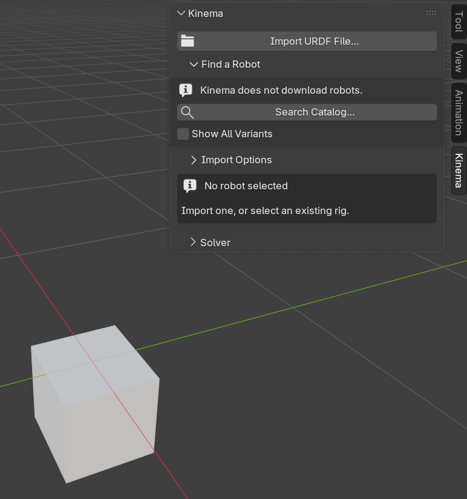
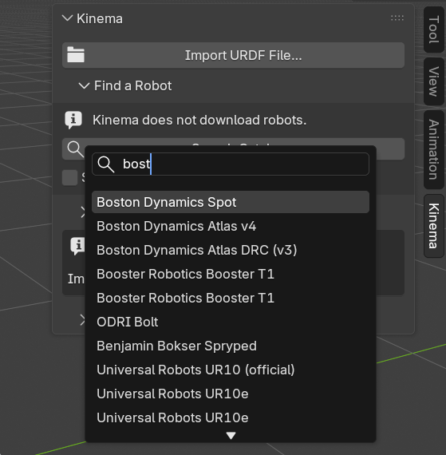
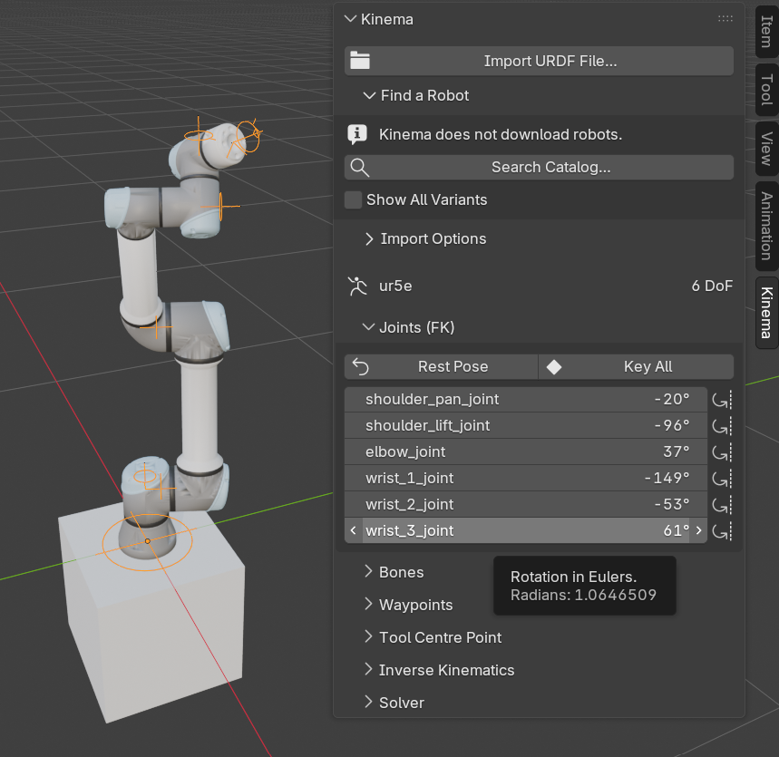
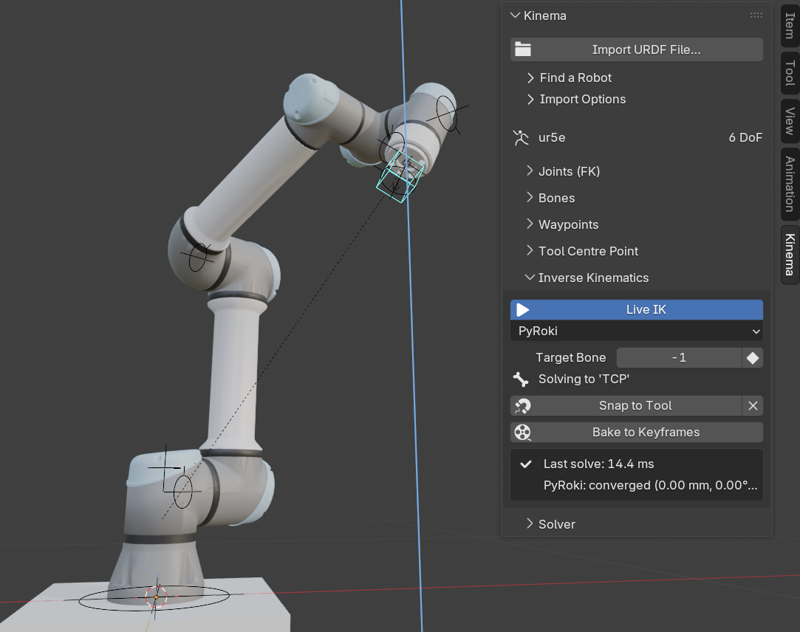

# Your first robot

Ten minutes, start to finish: fetch a robot description, import it, look at what you got,
and move it.

We will use a **UR5e** — a six-jointed industrial arm from Universal Robots. It is the
"default cube" of robot arms: small enough to understand, real enough to be useful.

You will need `git` on your machine for the first step. If you already have a URDF of your
own, skip to [importing your own robot](../tutorials/import-your-own.md) instead — the rest
of this page applies unchanged.

## 1. Open the Kinema tab

In the 3D viewport, press <kbd>N</kbd> to open the sidebar, then click the **Kinema** tab.

With nothing selected you will see two buttons and a note saying no robot is selected.
That is the starting state.

{ .screenshot }

## 2. Find the robot

Expand **Find a Robot** and click **Search Catalog…**.

A picker opens listing 186 robots — arms, humanoids, quadrupeds, drones, grippers — with
the maker and joint count for each. Type `ur5e` to filter, select it, and confirm.

{ .screenshot }

Nothing is imported yet. Kinema has copied a `git clone` command to your clipboard and is
showing you which file to open once you have run it:

```bash
git clone https://github.com/UniversalRobots/Universal_Robots_ROS2_Description.git
# cd Universal_Robots_ROS2_Description && git checkout 22f055da2fa7
# then open: urdf/ur.urdf.xacro
```

Paste that into a terminal — all three lines are safe to paste together, the last two are
comments — and let it clone.

!!! info "Why you and not Kinema"
    Kinema ships the *catalog* — names, makers, joint counts, and where each robot lives —
    but downloads nothing. Blender extensions may not fetch code or data after they are
    installed, and robot descriptions are other people's repositories under their own
    licences. See [Robot catalog](../reference/catalog.md).

## 3. Import it

Click **Import URDF File…**, navigate to the cloned repository, and open the file the
catalog named — `urdf/ur.urdf.xacro`.

Blender pauses while it reads the description and builds the rig. A second or two for an
arm like this one; longer for a humanoid, where most of the time goes on loading meshes.

## 4. Look at what you got

One armature, named after the robot, with its meshes parented to it. The Kinema panel now
shows the robot's name and **6 DoF** — six degrees of freedom, meaning six independently
movable joints. ([What's a DoF?](../concepts/links-and-joints.md))

Drop into **Pose Mode** and open the bone collections in the Properties editor
(Object Data → Bone Collections). You will find four:

| Collection | What is in it | Visible? |
|---|---|---|
| `Kinema/FK` | One bone per joint — your controls | Yes |
| `Kinema/TCP` | The tool centre point marker | Yes |
| `Kinema/IK` | The IK target, once you add one | **Hidden** |
| `Kinema/Mechanism` | Internal bones that make the rig work | **Hidden** |

!!! tip "Two collections start hidden on purpose"
    `Kinema/IK` and `Kinema/Mechanism` are hidden so that a fresh rig shows you controls
    and nothing else. If you were expecting more bones than you can see, they are there —
    just tucked away. Toggle their visibility any time.

Back in the sidebar, the **Bones** panel lists the same bones as rows. That is where you
point IK at a particular bone, and where you bolt a tool or a cable harness onto a link —
neither of which you need yet, but it is the panel you will come back to. See
[the sidebar reference](../reference/sidebar.md#bones).

## 5. Move it

In the **Joints (FK)** panel there is one slider per joint, labelled with the joint's
real name from the manufacturer's data, and each one is clamped to that joint's true
range of motion — you cannot drive the elbow through the forearm.

Drag a few. The arm moves.

{ .screenshot }

Two buttons sit at the top of that panel:

- **Rest Pose** — everything back to zero, the robot's home configuration
- **Key All** — a keyframe on every joint at the current frame

This is forward kinematics: you set joint angles, the robot's shape follows. It is exactly
how posing an ordinary Blender armature works.

## 6. Now do it the other way round

Open the **Inverse Kinematics** panel and click **Add IK Target**.

You get a control at the robot's tool tip. Grab it and move it — the whole arm
reconfigures to follow, respecting every joint limit. Keyframe that control and you have
animated the robot by animating the thing you actually care about: where the tool goes.

The panel reports how long each solve took, typically a few milliseconds.

{ .screenshot }

!!! warning "The first solve takes about 15 seconds"
    Creating the IK target compiles the solver for this specific robot, behind a wait
    cursor. It happens once per robot, never again. Later solves are milliseconds.

## Where to go next

- [Pose a robot by hand](../tutorials/pose-fk.md) — FK in depth, and when it is the right
  tool
- [Animate with an IK target](../tutorials/animate-ik.md) — the real animation workflow
- [Bake and hand off](../tutorials/bake.md) — make the `.blend` work on machines without
  Kinema
- [Import your own robot](../tutorials/import-your-own.md) — when the robot is not in the
  catalog

