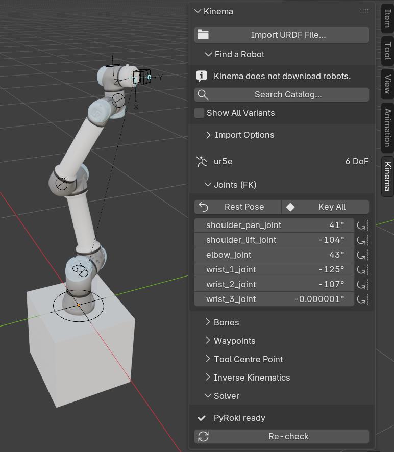

#  Kinema

**Animation-ready robot rigs in Blender.** Import a robot description and get a single clean
armature you can actually animate — with IK that understands singularities, joint limits and
multi-turn joints. A built-in catalog of 186 real robots tells you where to find one.

{ .screenshot }

## Who this is for

You know Blender. You are comfortable with armatures, pose mode, keyframes and the
sidebar. You have been asked to animate a robot arm — for a product shot, an explainer, a
game cinematic, a factory walkthrough — and the reference material you have been handed is
a folder of files with extensions you have never seen.

You do **not** need to know robotics. This site explains the handful of ideas you actually
need, in Blender's own vocabulary, at the point where you need them.

## What you get

When Kinema imports a robot, you end up with one armature that behaves like a rig an
animator would build by hand:

- **One armature.** Not armatures nested inside armatures.
- **One bone per joint**, each a true single-axis control with the real limits from the
  manufacturer's data already applied.
- **Bone collections** — `Kinema/FK`, `Kinema/IK`, `Kinema/TCP`, `Kinema/Mechanism` — so
  you see controls, not machinery.
- **An IK target you keyframe like any other**, but solved by a proper robotics solver
  instead of Blender's built-in one — and *what it aims at* is keyframable too.
- **Somewhere to bolt your tools.** Attach an object or a collection to any link, offset it
  from the joint, and it rides the robot.
- **A bake step**, so the finished `.blend` renders anywhere, with or without Kinema
  installed.

## Start here

- :material-download: **[Install](getting-started/install.md)**

    Get the right build for your machine and into Blender.

- :material-robot-industrial: **[Your first robot](getting-started/first-robot.md)**

    Catalog to posed arm in about ten minutes.

- :material-school: **[Concepts](concepts/links-and-joints.md)**

    The robotics vocabulary, explained for Blender people.

- :material-lifebuoy: **[Troubleshooting](troubleshooting.md)**

    Something looks wrong or nothing solves.

## Why Kinema exists

Every other Blender robotics tool treats Blender as a *design and export* station: you
build a robot, then send it out to a simulator. They optimise for producing simulation
assets.

Kinema optimises for the opposite thing — **open a `.blend`, find a clean rig, animate it,
hit render.** Blender is the destination, not a stop along the way.

That difference shows up everywhere in the rig. A simulation exporter is happy to nest
armatures, leave joint axes in whatever orientation the source file used, and expose every
internal transform as a control. None of that is animatable. Kinema spends its effort
making the result feel like a rig, because that is the thing you are going to spend eight
hours inside.

!!! info "Working on Kinema itself?"
    Build instructions, the bundled-wheel payload and the vendoring setup live in the
    [README](https://github.com/ebgenius/kinema#development) rather than here. This site
    is for using the add-on.
