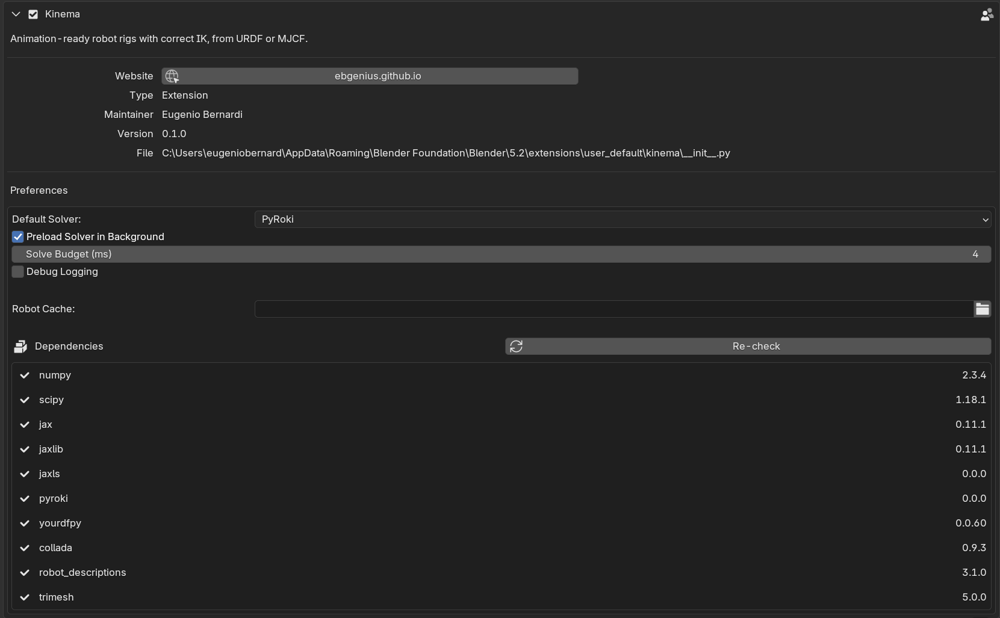

# Preferences

**Edit → Preferences → Add-ons → Kinema**, then expand the entry.

{ .screenshot }

## Default Solver

Which IK backend new rigs start with. Existing rigs keep whatever they were set to — this
is the default for the *next* one.

| Value | Behaviour |
|---|---|
| **PyRoki** (default) | Limit- and singularity-aware solver. Recommended. |
| **NumPy** | Lightweight damped least squares. No compile step, less robust near singularities. |
| **Off** | New rigs get no IK; they behave as plain FK armatures. |

Setting this to **Off** is reasonable if you mostly do FK work and do not want the solver
compiling on rigs you were not going to solve. You can still add IK per rig afterwards.

See [the two solvers](../concepts/ik.md#the-two-solvers).

## Solve Budget (ms)

*Default: 33. Range: 4–1000.*

If a live solve takes longer than this, Kinema pauses live updates and says so in the IK
panel.

33 ms is roughly one frame at 30 fps — the point past which dragging the IK target stops
feeling connected to the viewport.

Raise it for large rigs where you would rather have slow live feedback than none. Lower it
if you want the guard to trip sooner. Baking ignores this entirely: it solves every frame
however long that takes.

See [the solve budget](../concepts/ik.md#the-solve-budget).

## Debug Logging

*Default: off.*

Prints solver diagnostics to the system console.

Normally the solver's internal logging is silenced, because it emits several lines on
every single solve — which, with live IK running, is several lines per frame.

Turn this on when investigating a problem or filing a bug, and open the console first:

- **Windows** — Window → Toggle System Console
- **macOS / Linux** — launch Blender from a terminal to see the output

## Dependency report

The preferences also list every component Kinema depends on and whether it loaded, with a
version number or the import error.

This is the detailed version of the [Solver panel](sidebar.md#solver) status, and it is the
right thing to screenshot when reporting a problem. Nine entries, all of which should read
`ok`:

`numpy`, `scipy`, `jax`, `jaxlib`, `jaxls`, `pyroki`, `yourdfpy`, `collada`, `trimesh`.

!!! info "Changed in 0.3.0"
    Two preferences went away. **Robot Cache** pointed at a download directory, and there
    are no downloads any more. **Preload Solver in Background** imported the solver on a
    worker thread at startup, and Blender extensions may not start threads — the solver is
    imported on first use instead, which is where the 2–5 second pause now falls. The
    `robot_descriptions` row left the dependency list with the downloading catalog.
