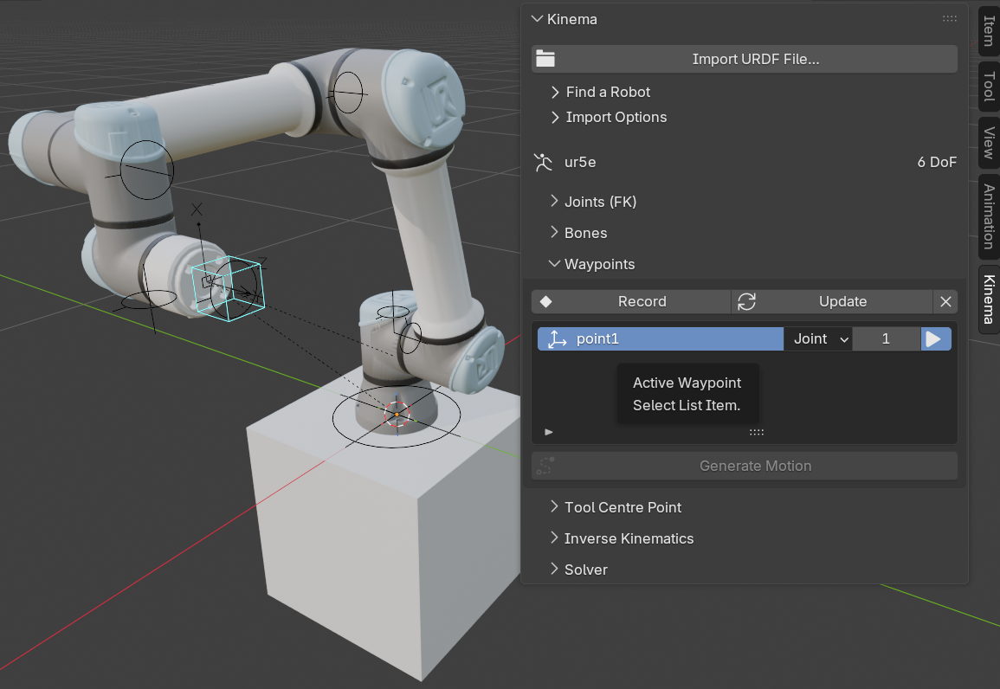

# The Kinema sidebar

Everything Kinema does lives in the 3D viewport sidebar. Press <kbd>N</kbd> and click the
**Kinema** tab.

There are seven panels. The last six only show anything useful when a Kinema rig is
selected.

{ .screenshot }

## Kinema

The top-level panel. Always available.

| Control | What it does |
|---|---|
| **Import URDF File…** | [Import a local file](../tutorials/import-your-own.md) — URDF, xacro or MJCF |
| **Find a Robot** | Collapsible. The [186-robot catalog](catalog.md) — see below |
| **Import Options** | Collapsible. Settings applied to the *next* import — see below |

### Import Options

Closed by default, and read at the moment you import: changing one does nothing to a robot
already in the scene. The same settings appear in the file browser's sidebar when you pick
a file, so you can set them either place.

| Control | What it does |
|---|---|
| **Bone Size** | Display size of the joint controls. `0` picks one from the robot's own scale |
| **Enforce Joint Limits** | Add limit constraints from the description. Turn off to pose past a robot's real limits for a shot |
| **Import Meshes** | Load the robot's visual geometry. Off gives bones only, which imports in a fraction of the time |
| **Import Collision Meshes** | Also load the coarse hulls a planner uses, into a separate collection that starts hidden — see [collision geometry](#collision-geometry) |
| **Create TCP** | Add a [tool centre point](../concepts/tcp.md) marker at the end of the chain |
| **Xacro Arguments** | Substitution arguments for a `.xacro`, in the syntax the `xacro` command line takes: `name:=ur5e ur_type:=ur5e`. Ignored for a plain URDF or MJCF |

Some descriptions cannot render without an argument, and the file browser lists the ones a
`.xacro` declares once you select it, with their defaults — so you can see what it wants
before importing rather than after failing. See [xacro files](../tutorials/import-your-own.md#xacro-files).

### Collision geometry

A robot description usually contains the robot twice: the **visual** geometry, which is what
it looks like, and the **collision** geometry, which is the coarse hull a motion planner
sweeps for contact. The hulls are cheap boxes and cylinders where the visual mesh has
fillets and bolt heads.

With **Import Collision Meshes** on, both arrive in their own collection under the robot's —
`⟨robot⟩ Visual` and `⟨robot⟩ Collision` — so either can be hidden as a group. Collision
starts hidden and draws as wire, so switching it on over the robot reads as an envelope
rather than as more casing.

You will not normally want it. It is useful when checking why a robot fails a reach, or when
exporting to something that needs the hulls.

### Find a Robot

Closed by default. It looks a robot up; it does not fetch one.

| Control | What it does |
|---|---|
| **Search Catalog…** | Open the fuzzy-search picker over the catalog's 186 entries |
| **Show all variants** | Also list the entries curated out as duplicates, broken or partial, which the picker hides by default |
| **Open Repository** | Open the last-picked robot's project page in your browser |

Picking a robot copies a `git clone` command to your clipboard and shows which file to open
once the clone finishes. Load that file with **Import URDF File…**. See
[Robot catalog](catalog.md).

With a Kinema rig selected the panel also shows the robot's name and its degree-of-freedom
count — `6 DoF` for a typical industrial arm.

With nothing selected it says **No robot selected**. That is the empty state, not an
error.

## Joints (FK)

One slider per movable joint, labelled with the joint's real name from the robot's
description file. Each is clamped to that joint's true range of motion.

| Control | What it does |
|---|---|
| **Rest Pose** | Return every joint to zero — the robot's documented home configuration |
| **Key All** | Insert a keyframe on every joint channel at the current frame |
| **Reset Meshes** | Put every link mesh back where the importer placed it |
| **Meshes at File Origin** | Send every link mesh to the coordinates its own file uses, for editing and export — see below |

*Reset Meshes* and *Meshes at File Origin* appear only on rigs that have visual meshes.
*Reset Meshes* exists because *Rest Pose* returns the **joints**, and a link mesh nudged by
accident is not a joint — see
[a mesh ended up in the wrong place](../troubleshooting.md#a-link-mesh-ended-up-in-the-wrong-place).
Objects you attached yourself are left alone.

!!! warning "Rest Pose cannot always reach zero"
    Some robots forbid their own zero configuration — every KUKA quantec limits its second
    axis to a range that stops short of it, because the real axis cannot reach 0°. With
    limits enforced the rig rests at the nearest allowed value instead, and says so on
    import. That is the honest answer rather than a fault; see
    [the robot will not go to its rest pose](../troubleshooting.md#the-robot-will-not-go-to-its-rest-pose).

### Meshes at File Origin

A tick, not a button, because it is a mode you leave again.

Improving a robot's geometry means editing a mesh and writing it back as a drop-in
replacement for the file the description points at. Exporters write **world** space, so the
mesh has to actually *be* at that file's coordinates — and on the rig it never is. The link
frame, the visual origin, the mesh scale and the file's own units and up-axis all sit
between the two.

Tick the box and every link mesh goes to the coordinates its own file uses. Edit, export,
untick, and they return exactly. The meshes stay parented to their bones while it is on, so
posing the rig drags them out of place — the panel says so while the tick is set, and
unticking is the way back.

Rigs imported before 0.4.0 recorded nothing about what was baked into their vertices, so
this cannot work on them; the button says so rather than moving them somewhere wrong.
Re-import to get it.

A rig with no movable joints — a fixed sensor mount, say — says so instead.

See [Pose a robot by hand](../tutorials/pose-fk.md).

## Bones

One row per bone, answering the two questions that come up as soon as a robot is imported:
what does IK aim at, and what is bolted to this link?

| Part of the row | What it does |
|---|---|
| **◉ radio** | Aim the solver at this bone. Offered on joint bones and on the TCP marker, which is the default |
| **Object / Collection** | Whether this bone takes a linked copy of an object, or an instance of a collection |
| **Picker** | The thing to attach. Pick one and a copy appears on the bone; clear it and the copy goes |
| **✕** | Unparent the attachment but leave it in the scene, where it appears |

The IK control bone is hidden from the list — it is a goal, not a part of the robot. Root
gets no radio, because there is nothing to solve to.

Below the list, for the highlighted row:

| Control | What it does |
|---|---|
| **⟨attachment name⟩** | Select the attachment, ready to move it |
| **Offset from the Bone** | Its location, rotation mode, rotation and scale — the offset from the joint |
| **Reset** | Sit the attachment exactly on the bone, with no offset |

An attachment is a **linked copy**: it shares mesh and materials with what you picked, so
the same harness can dress six links and be edited in one place. Its transform is its offset
from the bone, which is why scaling the *source* does not change it — scale the attachment
here instead. See [dressing a rig](../concepts/links-and-joints.md#attaching-things-to-a-link).

## Waypoints

Where you say what the robot should *do*. Teach it a set of poses, put each on the timeline,
and generate the motion between them.

{ .screenshot }

| Control | What it does |
|---|---|
| **Record** | Store the robot's current pose as a waypoint on the current frame |
| **Update** | Re-record the highlighted waypoint from the robot's current pose |
| **✕** | Delete the highlighted waypoint and its marker |
| **Generate Motion** | Key the robot through its waypoints in frame order |

Each row in the list is one waypoint:

| Part of the row | What it does |
|---|---|
| **Name** | Yours to set — `home`, `approach`, `pick`, `drop` |
| **Move** | How the robot *arrives* here: **Joint** or **Linear** |
| **Frame** | When it should be there. This is the ordering |
| **▶** | Jump to that frame and restore the exact configuration it was taught in |

A waypoint stores the tool pose **and** the joint values it was taught with. Both, because a
pose on its own does not say which way the elbow was bent — a six-axis arm can reach the
same tool pose up to eight different ways. **▶** restores the configuration you taught
rather than re-solving and picking a different one.

Each waypoint also gets an Empty in the viewport, so you can snap it to a vertex on the part
being worked. Dragging that Empty re-aims the move.

### Joint or Linear

| Move | What it does | Use it for |
|---|---|---|
| **Joint** | Interpolates the joints | Crossing the workspace. Fast, always reachable, and the tool takes whatever path falls out |
| **Linear** | Drives the tool along the straight line between the two poses | The part of the job that has to be straight — a weld seam, a plunge, a dispensing pass |

Linear needs an IK target on the rig; the panel says so if one is missing.

A joint move replays the joint values it was taught with, so it cannot follow a marker you
have since dragged somewhere else. Generating tells you which waypoints that applies to, and
the fix is either **Update** or switching the row to **Linear**.

### What Generate Motion writes

Ordinary keyframes. Joint channels for joint moves, the IK goal for linear ones, and the
live-IK switch keyed so each span is solved the way it should be.

Nothing about the result is special, which is the point — Blender's own graph editor shapes
it afterwards, and [Bake to Keyframes](../tutorials/bake.md) still reduces the whole thing to
plain joint curves that render with Kinema uninstalled.

Regenerating replaces the previous motion rather than layering on it, and only over the
frames the job actually covers: animation you keyed outside that range survives.

The **frame** field is where a retime sticks. The keys Generate Motion writes are its
output, so dragging those in the dope sheet retimes the animation until the next
regeneration writes the stored frames again.

See [Teach a robot a job](../tutorials/teach-a-job.md).

## Tool Centre Point

The [TCP](../concepts/tcp.md) is the working point of the robot: the tip of the tool, and
what IK aims at by default.

With a TCP on the rig, the panel shows which link it rides, its live X/Y/Z position and its
R/P/Y orientation — reported as the **tool** frame, not the marker bone's.

| Control | What it does |
|---|---|
| **Parent Bone** | The joint bone the TCP rides. Only joint bones can host it |
| **Tool Offset** | Location and roll/pitch/yaw from that joint's link frame — the flange |
| **Reset** | Zero the offset, putting the TCP on the flange itself |
| **Update TCP** / **Create TCP** | Apply the parent bone and offset. Reads *Create* when the rig has no TCP yet |
| **Move TCP to Active Bone** | The older route: place it on whichever bone is active in Pose or Edit mode |

The offset is rarely zero on a fresh import, and that is not a mistake: the tool frame is
the description's deepest link, which usually sits behind one or more *fixed* joints from
the last actuated one. Fixed joints get no bone, so the offset field is the only place that
distance is visible.

Angles are roll, pitch and yaw about fixed X, Y and Z — the convention URDF uses in
`<origin rpy="…">` — so a tool transform copied out of a description goes in unchanged.

## Inverse Kinematics

Before you add a target, this panel has one button:

| Control | What it does |
|---|---|
| **Add IK Target** | Create a keyframable control at the TCP |

Adding a target compiles the solver — roughly 15 seconds. It happens once per **bone** you
aim at, not once per robot, so pointing the target at a bone the solver has not seen before
pays it again. A handful of recent ones stay compiled, so scrubbing back and forth over a
hand-off is free after the first pass. It requires a TCP.

Once a target exists:

| Control | What it does |
|---|---|
| **Live IK** | Toggle continuous solving as the target moves. Enabled when the target is created. |
| **Solver** | PyRoki, NumPy or Off — see [the two solvers](../concepts/ik.md#the-two-solvers) |
| **Target Bone** | Which bone the solver aims at, by index. `-1` is the TCP |
| **Key Target Bone** | Keyframe that choice, so a shot can hand the goal from one bone to another |
| **Solving to '⟨bone⟩'** | Which bone that index currently resolves to |
| **Snap to Tool** | Move the target back onto the tool's current position |
| **✕** | Remove the IK target; the rig returns to plain FK |
| **Bake to Keyframes** | [Solve every frame and key the joints](../tutorials/bake.md) |

The friendly way to change the target is the radio column in the **Bones** panel; the field
here is the raw channel, and the button beside it is how you key it. Use the button rather
than <kbd>I</kbd>: the target is an index, not a quantity, and its keys have to *step*
between values. Interpolated, a hand-off from the tool point to joint 3 would pass through
joints 1 and 2 on the frames in between and solve two chains nobody asked for.

Below sits a readout box:

- **Last solve: N ms** — with a tick if within the solve budget, a warning if not
- **Over budget; live updates paused** — the guard described in
  [the solve budget](../concepts/ik.md#the-solve-budget)
- A one-line summary of how the last solve converged
- **PyRoki unavailable for this rig** plus the reason, if the good solver could not be
  used for this particular robot

See [Animate with an IK target](../tutorials/animate-ik.md).

## Solver

Global solver status, independent of which robot is selected. This is the panel to check
when something is wrong.

| It says | It means |
|---|---|
| ✓ **PyRoki ready** | The full solver is loaded. This is what you want. |
| **Solver loading…** / Using NumPy fallback | The solver stack has not been imported yet. It loads on first use, so click **Re-check** or add an IK target — expect a 2–5 second pause. |
| **PyRoki unavailable** + an error + Using NumPy fallback | The solver stack failed to load. The add-on still works, with the simpler solver. |

| Control | What it does |
|---|---|
| **Re-check** | Re-run the dependency check and refresh this panel |

The error line is the actual import failure, truncated to fit. It is the most useful piece
of information you can give in a bug report — see
[Solver unavailable](../troubleshooting.md#solver-unavailable).

## Menu entries

Kinema also adds two entries outside the sidebar, under **File → Import**:

| Entry | What it does |
|---|---|
| **Robot URDF (.urdf/.xacro)** | Same as Import URDF File… |
| **COLLADA (.dae)** | Import a `.dae` mesh — Blender 5.0 removed its own importer |
