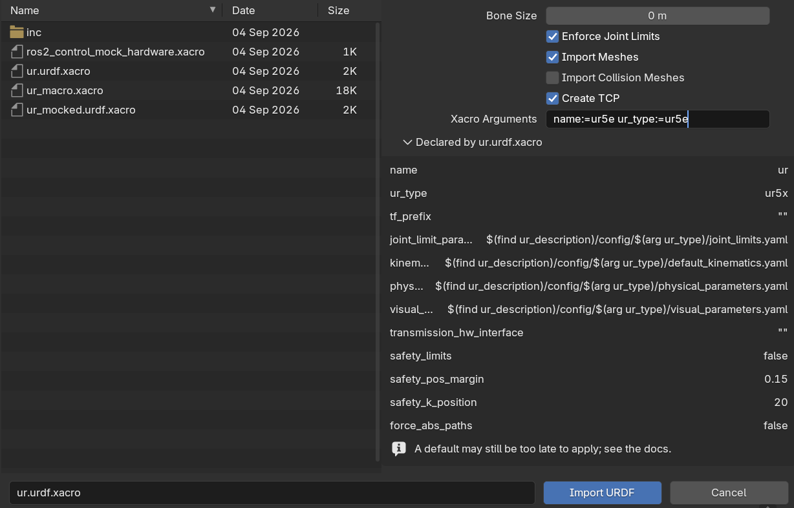

# Import your own robot

**Import URDF File…** is how every robot gets into Blender — a client's machine, an in-house
design, something a manufacturer published, or one of the 186 the
[catalog](../reference/catalog.md) pointed you at and you cloned. Kinema does not download
robot descriptions; it reads the files you already have.

## What you can import

Kinema reads three formats. See [URDF, xacro and MJCF](../concepts/formats.md) for what
each one is.

| Extension | Format |
|---|---|
| `.urdf` | URDF, the common robot description format |
| `.xacro` | A URDF template, expanded on import |
| `.xml` | Usually MJCF (MuJoCo); occasionally URDF |

!!! info "`.xml` is ambiguous, so Kinema looks inside"
    MJCF and URDF both commonly use `.xml`, so the extension decides nothing. Kinema reads
    the opening bytes of the file and picks the right reader. You do not have to tell it
    which you have.

## Import it

**Kinema panel → Import URDF File…**, then pick your file. The file browser filters to the
three extensions above.

The options sit in the sidebar of the file browser, and the same set is in the sidebar's
**Import Options** panel:

| Option | Default | What it does |
|---|---|---|
| **Bone Size** | 0.0 (auto) | Display size of the joint bones. Auto scales to the robot. |
| **Enforce Joint Limits** | on | Apply the real range-of-motion limits from the file |
| **Import Meshes** | on | Load the visual geometry and parent it to the rig |
| **Import Collision Meshes** | off | Also load the planner's coarse hulls, into a hidden collection |
| **Create TCP** | on | Add a [tool centre point](../concepts/tcp.md) at the end of the chain |
| **Xacro Arguments** | empty | Substitutions for a `.xacro`, as `name:=value` — see [xacro files](#xacro-files) |

{ .screenshot }

### When to change them

**Bone Size** — leave on auto unless the bones are visually swamping a very small robot
(a gripper, a finger) or vanishing inside a very large one. It is display only; it changes
nothing about the kinematics.

**Enforce Joint Limits** — turn off only when you know the file's limits are wrong or
missing, and you would rather have free rotation than a wrong constraint. With it off, IK
can produce poses the real machine cannot reach.

**Import Meshes** — turn off for a fast look at the kinematic structure alone, or when the
meshes are enormous and you only need the skeleton. You can always re-import.

**Import Collision Meshes** — leave off unless you need them. These are the coarse hulls a
motion planner sweeps, not what the robot looks like: boxes and cylinders where the visual
mesh has fillets and bolt heads. They arrive in a `⟨robot⟩ Collision` collection that starts
hidden, so they cost you nothing on screen, but on a large cell they double the object count.
Useful when checking why a robot fails a reach.

**Create TCP** — leave on. Without a TCP there is nothing for an
[IK target](animate-ik.md) to attach to, and you would have to create one by hand.

## Where meshes come from

URDF files refer to their meshes by path, very often using a `package://` URL that assumes
a ROS workspace you do not have. Kinema resolves these by searching the file's own
directory tree, which handles the overwhelming majority of real-world robot packages
without configuration.

If meshes do not appear, the usual causes are:

- You have the `.urdf` but not the `meshes/` folder next to it — download the whole
  package, not just the description file
- The meshes are in a format Blender cannot read
- The paths point outside the tree entirely, to an absolute location on someone else's
  machine

The rig itself is still correct in all three cases. Joints, limits and IK work fine on a
robot with no visible geometry — you just cannot see it.

!!! tip "COLLADA meshes"
    Blender 5.0 removed its own `.dae` importer, and a great many robot packages ship
    COLLADA meshes. Kinema brings that support back: it handles `.dae` files during robot
    import automatically, and also adds **File → Import → COLLADA (.dae)** for importing
    them on their own.

## xacro files

A `.xacro` is a URDF with macros, variables and conditionals in it — the format
manufacturers use to describe a family of robots in one file. Kinema expands it on import,
so you can point straight at the `.xacro` without generating a URDF first.

### Arguments

One file describing a family of robots has to be told *which* one. Those are xacro
arguments, and some descriptions will not render without them — Universal Robots'
`ur.urdf.xacro` is the common example: it uses `$(arg name)` on the line above the one that
declares it, so the default never applies and the file simply does not load until you supply
a name.

Select a `.xacro` in the file browser and Kinema lists the arguments it declares, with their
defaults, so you can see what it wants *before* importing rather than after failing. Fill in
the **Xacro Arguments** field using the same syntax the `xacro` command line takes:

```
name:=ur5e ur_type:=ur5e
```

Get one wrong and the error names the argument xacro asked for and lists the rest, instead
of the bare `Undefined substitution argument name` the underlying tool produces.

The arguments are stored on the rig, because the solver reloads the description later to
build its own model — a rig that imported cleanly and then quietly lost the good solver
would be a poor trade.

### Packages a xacro reaches for

A xacro refers to other packages by name: a KUKA arm pulls its materials from a sibling
`kuka_resources`. Kinema indexes the repository containing the file you picked, which covers
the usual case of one checkout holding everything.

When the pieces live in separate clones side by side, add the directory above them to
[Package Search Paths](../reference/preferences.md#package-search-paths).

## MJCF files

MuJoCo's format. Kinema reads the kinematic subset it needs: bodies, joints, limits and
visual geometry.

Two things to know:

- MJCF robots often ship OBJ meshes without their companion `.mtl` files. Blender's OBJ
  importer prints errors about this. They are harmless — MJCF carries its own colours.
- The solver reads URDF internally, so an MJCF rig is bridged by writing the parsed
  structure back out as a minimal URDF. This works, and is one more moving part; if an
  MJCF rig behaves oddly where a URDF one does not, that bridge is the first place to
  look.

## Unsupported joints

**Ball joints are rejected.** A 3-DoF spherical joint has no honest single-axis bone
equivalent, and pretending otherwise would give you a control that lies about what the
machine does. A robot containing one will not import.

This is rare — exactly one catalog robot (Cassie) is affected. Everything else parses.
